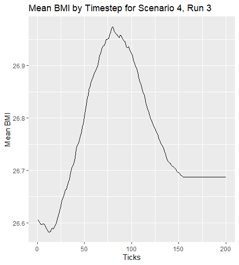

ABM Simulation
================
Cadence Doyle

# Overview

The goal is to create an agent-based model (ABM) of social influence on
obesity status. Individuals represented in this model observe the body
mass index (BMI) values of those with whom they are socially connected
and adjust their own BMI in response. Specifically, agents “follow the
average” of BMI values that they observe. This task is based on an
agent-based model that was developed by Hammond and Ornstein (2014).

# Model Specifications

## Agents

The population consists of 100 agents with a current BMI and a set of
social connections or friendships. The set of social connections will be
detailed in Environments. BMIs for agents are initialized
probabilistically from the distribution
15 + Gamma(α=3, β=.25)
The BMIs are created using a right-skewed gamma distribution as there
are typically more overweight individuals than underweight individuals
in US adults.

## Environment

Agents are connected by a static social network. Rather than having each
agent be influenced by all other agents in the population, agents will
only be influenced by agents they are connected to in the static social
network. The network is constructed using the Watts-Strogatz algorithm
with mean degree of 4 and a “rewiring probability” parameter that
determines the level of clustering in the network.

## Dynamics

During each model “tick” (detailed below in Time), agents have an
opportunity to update their BMI. To decide whether and how to do so,
agents consider the mean BMI among their “friends”, which are their
network neighbors. If the mean value of their neighbors’ BMI differs
from their own BMI value, they change their own BMI in the direction of
the mean. Now we know people may calculate this mean with some error, or
be satisfied with a BMI within some distance of their ideal. So I
introduce a “satisficing radius” around the mean of their network’s BMI,
meaning if the agent is inside the “satisficing radius” of the mean, the
agent does not adjust their BMI.

Agents change their BMI value by either .1 or the difference between
their BMI and the observed mean, whichever is smaller (i.e. they can
change BMI by a maximum of .1 during a “tick” but will not overshoot
their goal). I call this metric
.

## Time

Each timestep, or “tick”, in the model is an abstract unit of time in
which each agent, in random order, has an opportunity to update their
BMI once. For the purposes of this exercise, model runs will end after
200 ticks.

# Model Experimentation

I will run the model 10 times for each of 4 conditions:

1.  Low (0) “satisficing radius” and low (.1) “rewiring probability”
    parameter values
2.  High (.4) “satisficing radius” and low (.1) “rewiring probability”
    parameter values
3.  Low (0) “satisficing radius” and high (.9) “rewiring probability”
    parameter values
4.  High (.4) “satisficing radius” and high (.9) “rewiring probability”
    parameter values

## Model Design

To create the model, I wrote a function with four parameters: the
satisficing radius of the BMI adjustment, “satisficing”, the rewiring
probability parameter that determines the level of clustering in the
social static network, “rewiring\_probability”, the population size,
“n”, and the number of ticks, “iterations”.

``` r
ABM <- function(satisficing, rewiring_probability, n=100, iterations=200){
  initial_df <- data.frame(ID = 1:n,
                           BMI = 15 + rgamma(n, shape = 3, rate = .25))
    
  g <- igraph::sample_smallworld(dim = 1, size = n, nei = 2, p = rewiring_probability)
  
  edgelist <- igraph::get.edgelist(g) %>% 
    as.data.frame()
  
  mean_df <- data.frame(Ticks = 1:iterations,
                        BMI_equilibrium = 0,
                        Parameters = rep(paste0("Satisificing Radius =", 
                                                satisficing, 
                                                " Rewiring Probability =", 
                                                rewiring_probability),
                                         iterations)
                        )
  iter <- 1
  
  repeat{
    rand_order <- sample(1:n, n)
    for(i in 1:n){
      BMI_j <- rand_order[i]
      
      direction1_j <- edgelist %>% 
        dplyr::filter(V1== BMI_j) %>% 
        pull(V2)
      
      direction2_j <- edgelist %>% 
        dplyr::filter(V2 == BMI_j) %>% 
        pull(V1)
      
      get_BMI <- unique(c(direction1_j, direction2_j)) %>% 
        as.data.frame() %>% 
        dplyr::left_join(., initial_df, by = c("." = "ID")) %>% 
        dplyr::filter(`.` != BMI_j)
      
      get_BMI <- if(nrow(get_BMI)== 0){
        initial_df[BMI_j,]
      } else{
        get_BMI
      }
      
      BMI_ideal <- mean(get_BMI$BMI)
      
      epsilon <- if(abs(initial_df[BMI_j,2]- BMI_ideal) > .1 ){
        .1
      } else{
        abs(initial_df[BMI_j,2]- BMI_ideal)
      }
      
      new_BMI <- if(initial_df[BMI_j,2] > BMI_ideal + satisficing){
        initial_df[BMI_j,2] - epsilon
      } else if(initial_df[BMI_j,2] < BMI_ideal - satisficing){
        initial_df[BMI_j,2] + epsilon
      } else{
        initial_df[BMI_j,2]
      }
      
      initial_df[BMI_j,2] <- new_BMI
    }
    mean_df[iter,2] <- mean(initial_df[,2])
    
    iter <- iter+1
    if(iter > iterations){
      break
    }
  }
  final_df <- cbind(initial_df, Parameters = rep(paste0("Satisificing Radius =", 
                                           satisficing, 
                                           " Rewiring Probability =", 
                                           rewiring_probability),
                                    n))
  results <- list(final_df = final_df, mean_df = mean_df)
  return(results)
}
```

First, we need to create the population of 100 agents with two specified
properties: current BMI and a set of social connections. Below we
initialize BMI for each agent probabilistically as 15 + Gamma(α=3,
β=.25). The ID is the number assigned to the agent for traceability.

Next, we establish the environment for the agents. Using the R package
igraph, we use the Watts-Strogatz algorithm to connect the agents
through a static social network. The network has a mean degree of 4,
corresponding to an “nei” of 2. We incorporate the variable rewiring
parameter for flexibility, “rewiring\_probability”.

We can pull the edges of the graph to see which agents are connected to
one another using the function “edgelist”.

We want to be able to track the average BMI at each timestep of the
model, so we create an empty data frame to store the means in. We also
include the parameters to use later for graphing.

Knowing the model must run 200 times, we can start a count of iterations
with “iter”. Using the repeat function, we add one to “iter” each time
the model runs. Once we exceed the number of ticks, or “iterations”, we
stop running the model.

The agents have an opportunity to update their BMI once per timestep,
but they have to do so randomly. The “sample” function allows us to
create a random index to update the BMIs, so “rand\_order” stores that
index. BMI\_j is used to apply the random index to the initial table to
grab BMIs related to j.

Though Watts-Strogatz is an undirected graph, the function igraph stores
the edges as directional. Therefore, we have to look at both the first
and second columns in the edgelist to ensure we collect all agents
connected to agent j. “direction1\_j” and “direction2\_j” accomplish
this effort.

To get the BMI of the connected agents, we then combine them and pull
unique values in case our graph had loops. We join the agent ID’s to the
initial data frame to get the BMIs of the agents connected to agent j.
If there are no agents connected to agent j, we ensure at least agent
j’s BMI is pulled to prevent errors further on.

We then average the BMIs of all connected agents, this is the ideal BMI
or “BMI\_ideal”. If there are no connected agents, BMI\_ideal will
simply return the BMI of agent j.

Next, we define epsilon as the amount that an agent can change their BMI
value. “epsilon” is either .1 or the difference between their BMI and
the observed mean, whichever is smaller. “epsilon” is used to determine
agent j’s new BMI, or “new\_BMI” using the following logic:

If BMI\_j is greater than the BMI\_ideal plus the satisficing radius,
decrease BMI by the value of “epsilon”; if BMIj is less than the
BMI\_ideal minus the satisficing radius, increase BMI by the value of
“epsilon”; Otherwise, make no adjustments to BMI,

We then store the updated BMI\_j in the initial data frame, and the loop
starts over for BMI\_(j+1). Once all agents have a chance to update
their BMI in a timestep, the mean BMI of that timestep is recorded in
the data frame mentioned above with the corresponding iteration, “iter”.
One iteration is added to “iter”, meaning we’ve completed a process for
a timestamp. Once we exceed 200 iterations, the model stops running.

After the model finishes running, we save one additional piece of
information, which is the final BMI for each agent along with the
parameters used. Both the final BMI table and the table of mean BMIs is
saved.

## Model Implementation

``` r
runs <- 10

scenario1 <- purrr::map(seq_len(runs), ~ABM(satisficing = 0, 
                                          rewiring_probability = .1, 
                                          n = 100, 
                                          iterations = 200)
)

scenario2 <- purrr::map(seq_len(runs), ~ABM(satisficing = .4, 
                                          rewiring_probability = .1, 
                                          n = 100, 
                                          iterations = 200)
)

scenario3 <- purrr::map(seq_len(runs), ~ABM(satisficing = 0, 
                                          rewiring_probability = .9, 
                                          n = 100, 
                                          iterations = 200)
)

scenario4 <- purrr::map(seq_len(runs), ~ABM(satisficing = .4, 
                                          rewiring_probability = .9,
                                          n = 100, 
                                          iterations = 200)
)
```

The instructions specify that each set of parameters must be run 10
times. “purrr::map()” is a function that allows us to transform an input
by applying a function to each element of the list. “seq\_len(runs)”
creates a vector of 1 through 10, meaning the function ABM is run 10
times. Each run is saved as a list, and has a sublist containing the
mean\_df and the final\_df for the particular model run and model
conditions. Now we can look combine the data to observe the
implications.

## Data Wrangling

``` r
scenario1_mean_df <- scenario1 %>% 
  purrr::map("mean_df") %>% 
  purrr::imap_dfr(~ .x %>% 
                    mutate(run_id = .y)) %>% 
  mutate(scenario_id = 1)

scenario2_mean_df <- scenario2 %>% 
  purrr::map("mean_df") %>% 
  purrr::imap_dfr(~ .x %>% 
                    mutate(run_id = .y))%>% 
  mutate(scenario_id = 2)


scenario3_mean_df <- scenario3 %>% 
  purrr::map("mean_df") %>% 
  purrr::imap_dfr(~ .x %>% 
                    mutate(run_id = .y))%>% 
  mutate(scenario_id = 3)


scenario4_mean_df <- scenario4 %>% 
  purrr::map("mean_df") %>% 
  purrr::imap_dfr(~ .x %>% 
                    mutate(run_id = .y))%>% 
  mutate(scenario_id = 4)

all_scenarios_mean_df <- bind_rows(scenario1_mean_df, scenario2_mean_df, scenario3_mean_df, scenario4_mean_df)
```

Above we use various functions in the “purrr” package to extract the
mean\_df from each run under each scenario. We also create two new
columns to store the “run\_id” and “scenario\_id”. We then bind all the
rows together in order to look at the data in the aggregate.

``` r
scenario1_final_df <- scenario1 %>% 
  purrr::map("final_df") %>% 
  purrr::imap_dfr(~ .x %>% 
                    mutate(run_id = .y)) %>% 
  mutate(scenario_id = 1)

scenario2_final_df <- scenario2 %>% 
  purrr::map("final_df") %>% 
  purrr::imap_dfr(~ .x %>% 
                    mutate(run_id = .y))%>% 
  mutate(scenario_id = 2)


scenario3_final_df <- scenario3 %>% 
  purrr::map("final_df") %>% 
  purrr::imap_dfr(~ .x %>% 
                    mutate(run_id = .y))%>% 
  mutate(scenario_id = 3)


scenario4_final_df <- scenario4 %>% 
  purrr::map("final_df") %>% 
  purrr::imap_dfr(~ .x %>% 
                    mutate(run_id = .y))%>% 
  mutate(scenario_id = 4)

all_scenarios_final_df <- bind_rows(scenario1_final_df, scenario2_final_df, scenario3_final_df, scenario4_final_df)
```

We use the same techniques to look at the “final\_df” from all
scenarios. Next we want to look at different plots.

## Data Visualization and Results

All graphs were made with ggplot, and I’ve adjusted the labels to be
more descriptive.

``` r
ggplot(scenario4[[3]]$mean_df, mapping = aes(x = Ticks, y = BMI_equilibrium))+
  geom_line()+
  labs(y = "Mean BMI", title = "Mean BMI by Timestep for Scenario 4, Run 3")
```

<!-- -->

### One Run’s Means - Code Explanation

In this particular graph I’ve selected one of the model runs from
scenario 4 to look at closer. This graph shows the mean BMI at each time
step, or tick, with a high (.4) “satisficing radius” and high (.9)
“rewiring probability” parameter values.

### One Run’s Means - Conclusions Drawn

As time goes on, all agents converge to the mean of the population BMI.
Since our population BMI is right-skewed, the adjustments will drive up
the population BMI over time. This one run suggests that agents follow
the average of the BMI values they observe, but looking at the aggregate
will uncover deeper intricacies.

### All Runs’ Means - Code Explanation

The plot below shows the average BMI taken at each tick, for each run
and scenario. As a reminder: Scenario 1 had a low (0) “satisficing
radius” and low (.1) “rewiring probability” Scenario 2 had a high (.4)
“satisficing radius” and low (.1) “rewiring probability” Scenario 3 had
a low (0) “satisficing radius” and high (.9) “rewiring probability”
Scenario 4 had a high (.4) “satisficing radius” and high (.9) “rewiring
probability”

``` r
ggplot(all_scenarios_mean_df, mapping = aes(x = Ticks, y = BMI_equilibrium, color = as.factor(run_id)))+
  geom_line()+
  facet_wrap(~ scenario_id, scales = "free")+
  labs(y = "Mean BMI", title = "Mean BMI by Timestep", color = "Run Number")
```

<!-- -->

Here I’ve compiled all model runs to observe how the mean BMI changes at
each timestep for the different model conditions and model runs. The
“face\_wrap” function allows me to split the data into four graphs, each
containing the runs of a separate scenario. The “scales = free” argument
allows the program to select the best y axis fit.

### All Runs’ Means - Conclusions Drawn

All these model runs continue to coverage to a BMI that was higher than
the initial BMI due to the right skew of the population’s BMI. There are
strong similarities between the model runs of scenario 1 and scenario 3.
Their low satisficing radius gives the agents a higher probability of
being dissatisfied with their current BMI, and they’ll adjust their BMI
frequently. This can also drive up the equilibrium BMI. Scenario 4 had
the smallest equilibrium BMI, which can be attributed to the high
satisficing radius. However, scenario 3 had smaller equilibrium BMIs
than scenario 1, which indicates that the high rewiring parameter can
have an impact on BMI.

``` r
ggplot(all_scenarios_final_df, mapping = aes(x = BMI))+
  geom_histogram(mapping = aes(fill = as.factor(run_id)))+
  labs(y = "Number of Agents", x = "BMI Equilibrium Distribution", fill = "Model Iteration", title = "BMI Equilibrium Distribution by Scenario")+
  facet_wrap(~scenario_id)
```

    ## `stat_bin()` using `bins = 30`. Pick better value with `binwidth`.

<!-- -->

### All Runs’ Equilibrium - Code Explanation

In this figure, I plot the distribution of the final BMIs, or the BMI
Equilibrium, in each model run. Similar to the model above, the
“face\_wrap” function allows me to split the data into four graphs, each
containing the runs of a separate scenarios. I changed the “run\_id” to
a factor, since the “run\_id”s are discrete and not continuous
variables.

### All Runs’ Equilibrium - Conclusions Drawn

It also seems that a high rewiring parameter can lead to greater spread
of the equilibrium BMIs.

``` r
ggplot(all_scenarios_final_df, mapping = aes(x = BMI))+
  geom_histogram(mapping = aes(fill = as.factor(scenario_id)))+
  labs(y = "Number of Agents", x = "BMI Equilibrium Distribution", fill = "Scenario", title = "BMI Equilibrium Distribution by Scenario")
```

    ## `stat_bin()` using `bins = 30`. Pick better value with `binwidth`.

<!-- -->

### All Runs’ Equilibrium - Code Explanation

This figure is very similar to the one above, but I look at the
scenarios in the aggregate, rather than looking at the individual runs.
Not that it is no longer facet wrapped, but color coded by scenario\_id.

### All Scenarios’ Equilibrium - Conclusions Drawn

With a majority of equilibrium BMIs below 30, scenario 4 is the ideal
scenario. A high satisficing radius and a high probability of rewiring
leads to a population that is less likely to change their BMI, and more
likely to adjust additional friendship ties.
